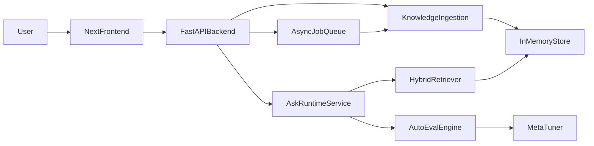

# EMATA Runtime Rebuild Architecture

## Components
- `backend/app/routes.py`: API endpoints for ask, knowledge, eval, and tuning.
- `backend/app/rag.py`: chunking, embedding, and retrieval pipeline.
- `backend/app/eval.py`: confidence and aggregate evaluation metrics.
- `backend/app/meta.py`: adaptive top-k tuning based on recent quality metrics.
- `backend/app/jobs.py`: async ingestion queue and worker loop (Temporal-like skeleton).
- `frontend/app/*`: UI pages for Ask, Knowledge Upload, and Evaluation dashboard.

## Data Flow
1. Upload file -> chunk & embed -> stored in runtime DB.
2. Ask request -> retrieve relevant chunks -> grounded answer + confidence.
3. Metrics are collected per request.
4. Meta tuner adjusts retrieval top-k from live metrics.
5. Async upload endpoint enqueues ingestion jobs and worker processes them in background.
